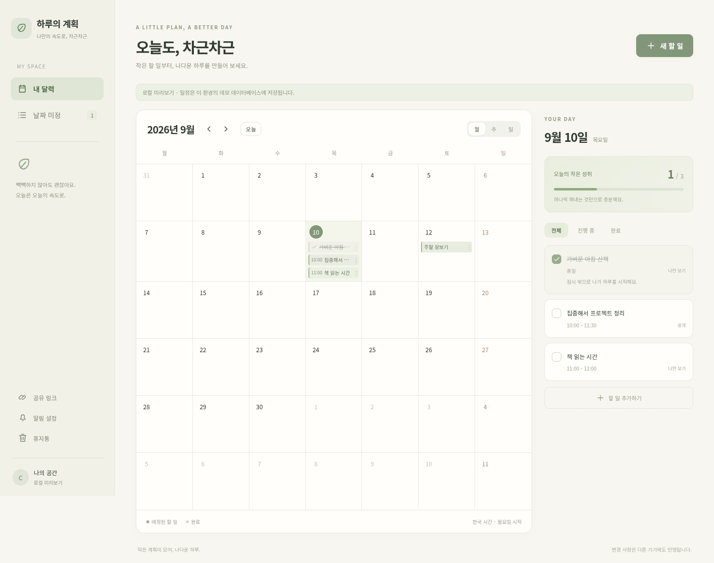
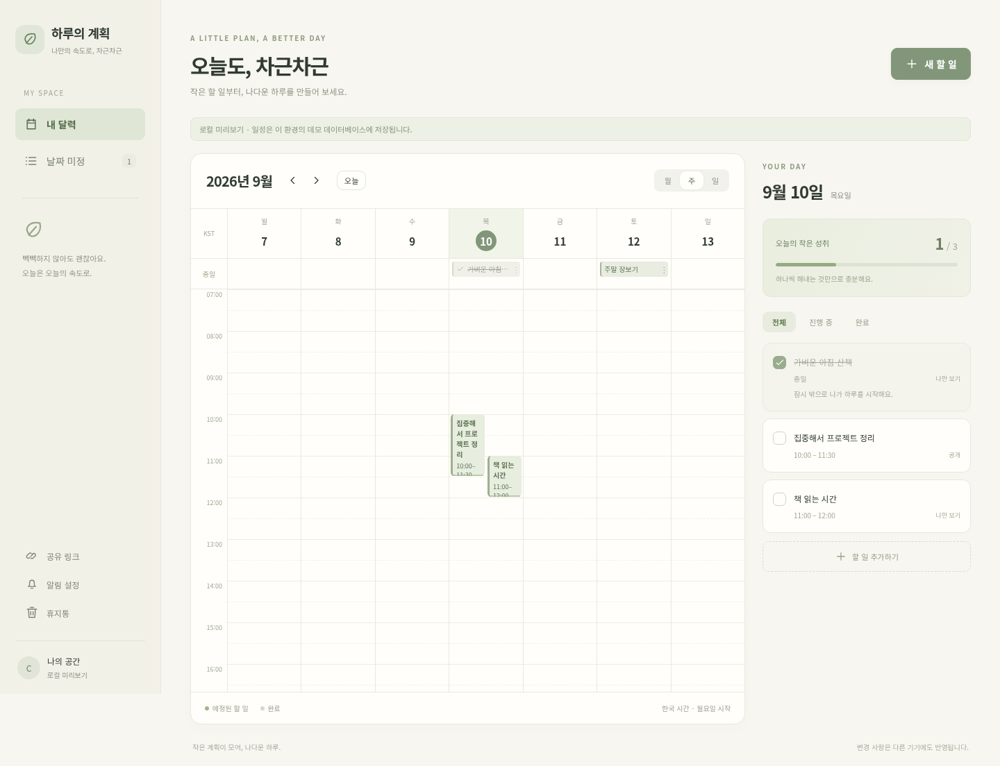
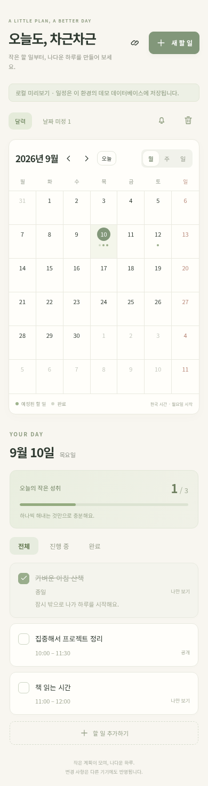
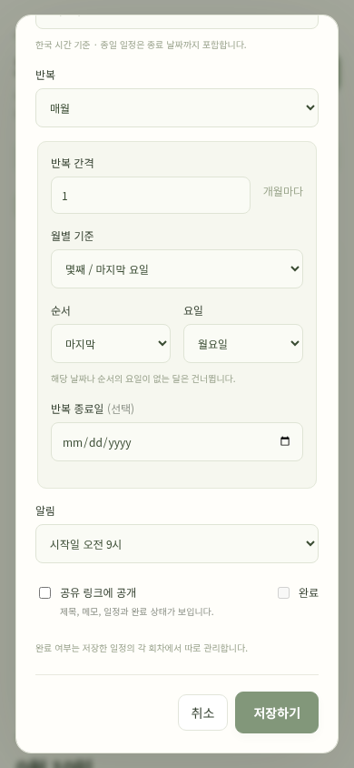

# 하루의 계획

크림·세이지 색감으로 하루를 차분하게 정리하는 개인 일정·할 일 앱입니다. 하나의 목록을 월·주·일 달력으로 보고, 공개할 일정만 읽기 전용 링크로 나눌 수 있습니다.

[서비스 열기](https://plan.crasnec.com) · [에이전트 API](AGENT_API.md) · [보안 감사](SECURITY_AUDIT.md)

운영 서비스는 소유자 전용입니다. 직접 체험하려면 아래의 **로컬 데모**를 실행하세요.

## 화면 미리보기

실제 앱을 로컬 데모 데이터로 촬영한 화면입니다. 운영 계정의 일정이나 인증 정보는 포함하지 않았습니다.

### 월간 달력

달력과 선택한 날짜의 할 일을 함께 확인합니다.



### 주간 시간표

시작·종료 시간을 한눈에 보고, 겹치는 일정은 경고 없이 나란히 표시합니다.



### 모바일과 반복 일정

작은 화면에서도 날짜별 목록을 확인하고, ‘매월 마지막 월요일’ 같은 반복 규칙을 설정합니다.

<p>
  
  
</p>

## 기술 구성

React + TypeScript, Express, Node.js 내장 SQLite로 구성했습니다. 달력·시간표·겹침 배치·드래그·반복 규칙·회차 예외는 직접 구현했습니다. Google 인증과 Web Push에는 프로토콜 라이브러리를 사용하며, 달력·UI·날짜·상태 관리·ORM 라이브러리는 사용하지 않습니다.

시간 지정 일정은 **UTC로 저장하고 한국 시간(Asia/Seoul)으로 고정 표시**합니다. 종일 일정은 날짜로 저장합니다. 초기 배포 구조는 SQLite를 사용하는 단일 앱 인스턴스와 HTTPS를 담당하는 Caddy입니다.

## 로컬 실행

Node.js 22.16 이상이 필요합니다. Node 22의 내장 SQLite 모듈은 실험적 경고를 출력할 수 있습니다.

```sh
npm ci
npm run check
npm test
DEMO_MODE=1 APP_ORIGIN=http://localhost:3000 npm run dev
```

`http://localhost:3000`에서 미리 볼 수 있습니다. 데모는 `data/demo.sqlite`에 별도 저장하며 샘플 일정이 포함됩니다. 로컬 호스트에서만 사용 가능하고 운영 모드에서는 시작을 거부합니다. 자동 새로고침 개발 서버 대신 `npm run build` 후 서버를 재시작합니다.

실제 계정으로 실행하려면 `.env.example`을 `.env`로 복사하여 값을 입력합니다. 로컬 실행의 `DATABASE_PATH`는 `data/plan.sqlite`처럼 쓰기 가능한 경로로 바꾸세요. 운영 설정에서 `DEMO_MODE`는 지정하지 않습니다.

| 환경 변수 | 용도 |
| --- | --- |
| `APP_ORIGIN` | 서비스 주소. 운영에서는 HTTPS 필수 |
| `OWNER_EMAIL` | 편집 권한을 갖는 Google 계정 |
| `GOOGLE_CLIENT_ID`, `GOOGLE_CLIENT_SECRET` | Google 웹 애플리케이션 OAuth 인증 정보 |
| `VAPID_PUBLIC_KEY`, `VAPID_PRIVATE_KEY`, `VAPID_SUBJECT` | Web Push 키와 운영자 연락처 |
| `DATABASE_PATH` | SQLite 파일 경로 |
| `PORT` | 앱 내부 포트. 기본값 `3000` |
| `CADDY_NETWORK` | 앱과 프록시가 공유하는 Docker 네트워크 |

## 구현 기능

- 한국 시간 고정, 월요일 시작 월·주·일 달력. 월간 모바일은 점 표시와 선택 날짜 목록.
- 날짜 미정, 종일, 시작·종료 시간, 여러 날 일정, 메모, 완료, 공개 설정.
- 메모의 기본 마크다운 표시: 제목, 강조·기울임·취소선, 목록·체크 목록, 인용, 링크, 인라인 코드·코드 블록. 편집 중 미리보기와 공유 상세에서도 표시합니다. HTML·이미지·표·중첩 목록은 지원하지 않으며, 링크는 HTTP·HTTPS·메일 주소만 허용합니다.
- 긴 제목·메모는 화면 폭 안에서 줄바꿈하고 달력 제목은 말줄임합니다. 카드 메모와 긴 코드 블록은 내부 스크롤로 확인합니다.
- 시간 겹침은 자연스럽게 나란히 배치. PC 드래그 이동과 끝부분 핸들로 기간 조절.
- 매일·매주·격주·매월 날짜·말일·몇째 요일·마지막 요일 반복.
- 이번만·이번부터 이후·전체 변경, 회차별 완료·공개 설정.
- 휴지통 30일 보관과 복구. 다른 회차 변경을 유지하며 개별 삭제를 복구.
- Google 계정 `crasnec@gmail.com`만 편집. 서버 측 인증·권한·Origin 검사.
- 브라우저 로그인 실패·권한 없음·없는 페이지는 전용 안내 화면과 복귀 링크 제공. API 오류는 JSON 유지.
- 공개 전용 공유 링크 발급·재발급·비활성화. 방문자는 완료 항목 필터 가능.
- 소유자 기기 간 서버 이벤트 동기화, 재연결 재조회. 공유 화면은 15초 간격 갱신.
- 기기별 Web Push 등록/해제와 영구 발송 기록, 재시도, 만료 구독 정리.
- Docker Compose, 기존 Caddy 연결 예시, SQLite 온라인 백업 및 무결성 검사.

## Google 로그인

Google Cloud에서 웹 애플리케이션 OAuth 클라이언트를 만들고 다음 리디렉션 URI를 등록합니다.

```text
https://plan.crasnec.com/auth/google/callback
```

`.env`에 `GOOGLE_CLIENT_ID`, `GOOGLE_CLIENT_SECRET`, `OWNER_EMAIL`을 설정합니다. OpenID Connect 코드 흐름, PKCE, state, nonce와 ID 토큰 검증을 적용했습니다. 최초 소유자 로그인 후 Google의 `sub`도 저장하여 같은 계정인지 확인합니다. 비밀값을 저장소에 커밋하지 마세요.

## 알림

```sh
npm run keys
```

출력된 VAPID 공개키와 비밀키를 `.env`에 한 번 저장합니다. 이미 구독한 기기가 있다면 임의로 키를 바꾸지 않습니다. HTTPS에서 앱을 열고 PC와 안드로이드 각각 ‘알림 설정 → 이 기기 알림 켜기’를 누릅니다.

기본 알림은 시간 지정 10분 전, 종일 시작일 오전 9시입니다. 완료된 회차에는 발송하지 않습니다. 서버는 30초마다 현재 일정으로 발송 대상을 다시 계산합니다. 재시작 후에도 15분 이내의 지연 알림을 처리하고, 더 오래된 알림은 생략합니다. 가까운 일정과 DB의 영구 발송 기록으로 복구하며 불필요한 미래 예약을 쌓지 않습니다.

기기별 최대 5회 재시도합니다. 전송 성공 직후 서버가 중단되면 중복 전송될 수 있어 푸시 topic과 알림 tag도 동일하게 사용합니다. 앱을 닫아도 수신하는 방식이지만, 브라우저 강제 종료·OS 배터리 제한·권한·네트워크에 따른 실제 전달은 기기 검증이 필요합니다. 현재 구독 허용 호스트는 Google FCM, Firefox 및 Windows Push입니다.

## 실행 취소와 다시 실행

달력 위의 **실행 취소 / 다시 실행** 버튼 또는 `Ctrl/⌘+Z`, `Ctrl/⌘+Shift+Z`를 사용합니다. `Ctrl+Y`도 다시 실행합니다. 입력창 안에서는 텍스트 자체의 기본 되돌리기가 유지됩니다.

- 일정 생성·수정·완료·이동·삭제·휴지통 복구가 대상입니다. 반복 회차 예외와 시리즈 분리도 작업 전 상태로 함께 복원합니다.
- 같은 로그인 세션의 최근 20개 작업을 저장합니다. 같은 세션을 사용하는 탭끼리는 기록을 공유하며, 새로고침에는 유지됩니다. 서버 재시작·로그아웃 또는 마지막 작업 후 30분이 지나면 이용할 수 없습니다.
- 실행 취소 후 새 일정 작업을 하면 다시 실행 기록은 비워집니다. 바뀐 내용이 없는 저장은 기록하지 않습니다.
- 현재 일정·휴지통 상태가 기록과 다르면 HTTP 409로 중단합니다. 다른 기기·에이전트의 변경을 덮어쓰지 않는 보수적인 방식이며, 무관한 일정 변경도 충돌로 판단할 수 있습니다. 버전 번호는 되돌리지 않아 오래된 편집 요청을 계속 차단합니다.
- 기록은 메모리에만 보관합니다. 작업 전후 스냅샷 합계가 1MiB를 넘으면 해당 세션 기록을 비우고, 전체 기록은 16MiB 이내로 제한합니다. 일정 저장 자체는 계속 동작합니다.
- 공유 설정·인증·API 키·알림 구독은 대상이 아닙니다. 이미 전달된 푸시 알림도 취소하거나 재발송하지 않습니다.

소유자 세션 API: `GET /api/history`, `POST /api/history/undo`, `POST /api/history/redo`. POST 본문에는 조회 결과의 해당 작업 `id`를 넣습니다. 같은 Origin의 JSON 요청만 허용하며 에이전트 Bearer 키로는 사용할 수 없습니다.

## 반복 일정의 세부 정책

- 종일의 DB 종료일은 제외 경계입니다. 화면의 종료 날짜는 마지막 포함 날짜입니다.
- 월 31일이나 다섯째 요일이 없는 달은 건너뜁니다. ‘말일’, ‘마지막 요일’ 옵션은 해당 월에서 실제 날짜를 계산합니다.
- 회차 식별자는 원래 한국 날짜입니다. 개별 회차를 옮겨도 식별자가 유지됩니다.
- 전체 변경은 선택 회차의 이동량을 시리즈 시작점에 적용합니다. 이번부터 이후는 시리즈를 분리합니다.
- 개별 완료·공개·메모 등 명시적 예외는 전체 편집보다 우선합니다. 완료하거나 직접 옮긴 회차의 실제 날짜를 보존합니다.
- 반복 규칙 변경으로 예외 회차가 더 이상 생성되지 않으면 그 회차는 독립 일정으로 보존합니다. 삭제 예외는 되살리지 않습니다.
- 삭제 범위가 겹쳤다면 상위 시리즈 또는 최근 삭제 범위를 먼저 복구해야 할 수 있습니다. 복구 충돌을 자동 덮어쓰기하지 않습니다.
- 초기 입력 범위는 1970~2200년, 한 일정의 기간은 최대 366일, 조회는 최대 100일입니다.

## Docker와 Caddy

```sh
cp .env.example .env
# .env에 실제 인증값 및 Caddy 네트워크 이름 입력
sudo -n docker compose up -d --build
```

Caddy와 공유하는 Docker 네트워크 이름을 `CADDY_NETWORK`에 지정합니다. `deploy/Caddyfile.example`의 사이트 블록을 기존 Caddy 설정에 추가하고 해당 Caddy 구성에 맞춰 reload 합니다. 앱 포트는 호스트에 공개하지 않습니다.

앱은 비루트 사용자, 읽기 전용 루트 파일시스템, 데이터·백업 볼륨으로 실행합니다. SQLite는 단일 앱 인스턴스에서 사용합니다. 데이터와 WAL 파일은 `plan-data` 볼륨에 보관합니다. 초기 스키마 버전은 `migrations` 테이블에 기록됩니다. 후속 스키마 변경은 명시적 버전 마이그레이션으로 추가해야 합니다.

## 백업과 복구

```sh
sudo -n docker compose exec plan-app npm run backup
```

백업은 `/app/backups`의 별도 볼륨에 생성하며 SQLite 온라인 백업 API와 `integrity_check`를 사용합니다. 서버 밖으로 정기 복사하고 보관 주기를 설정하세요.

복구할 때는 앱을 중지한 뒤 현재 데이터 볼륨을 별도로 보관하고, 검증된 백업을 `plan.sqlite`로 배치합니다. 이전 WAL/SHM이 복구본에 적용되지 않도록 기존 DB·WAL·SHM을 함께 분리하고 소유권을 앱 사용자(uid 1000)에 맞춘 후 시작합니다. `docker compose down -v`는 영구 볼륨을 삭제하므로 일반 재배포에 사용하지 않습니다.

## 검증

`npm run check`와 `npm test`로 날짜·반복 경계, 회차 예외, 공개 데이터, 권한·Origin 차단, 삭제·복구, UTC 변환, 겹침 배치, SQLite 지속성·백업, 알림 처리를 확인합니다.

브라우저 검증은 앱에 의존성을 추가하지 않고 기존 Playwright 설치를 사용할 수 있습니다.

```sh
PLAYWRIGHT_MODULE=/absolute/path/to/playwright/index.mjs node scripts/browser-smoke.mjs
```

스크린샷은 `artifacts/`에 저장됩니다. 테스트는 자체 임시 DB와 로컬 데모 서버를 만들고 종료합니다.

## 검증 범위와 운영 시 확인할 점

2026-09-10 기준 타입 검사와 테스트 41개, 운영 도메인의 HTTPS 응답·OAuth 시작 리디렉션·미인증 API 접근 차단을 확인했습니다. Google 계정의 실제 로그인 완료와 PC/안드로이드에서 앱을 닫은 상태의 알림 전달은 사용자 기기에서 추가 확인해야 합니다. 로컬 테스트 통과가 모든 운영 환경의 동작을 보증하지는 않습니다.

## 전용 Caddy로 배포

80/443 포트를 사용하는 기존 프록시가 없는 서버에서만 다음 구성을 사용합니다. 기존 Caddy가 있다면 `compose.yaml`만 실행하고 `deploy/Caddyfile.example`의 사이트를 기존 프록시에 추가합니다.

```sh
# 각 파일에는 OAuth 값 하나만 넣습니다. 원본과 .env는 Git/Docker에서 제외됩니다.
npm ci
node scripts/configure-local.mjs
sudo -n docker network create caddy # 이미 존재하면 생략
sudo -n docker compose -f compose.yaml -f compose.edge.yaml up -d --build --wait
```

`configure-local.mjs`는 로컬 `oauth-id.txt`·`oauth-secret.txt`를 읽어 권한 0600의 `.env`를 생성하고 VAPID 키를 생성합니다. 기존 `.env`는 덮어쓰지 않습니다. Google 콘솔의 승인된 리디렉션 URI는 `https://plan.crasnec.com/auth/google/callback`입니다. DNS가 서버를 가리키고 외부 TCP 80/443이 도달해야 HTTPS 인증서가 발급됩니다. DB·백업·인증서 볼륨은 재배포 시 유지해야 합니다.

## 에이전트 API와 보안 감사

소유자로 로그인한 뒤 PC 사이드바의 **API 키 관리**, 모바일의 **API 키**를 누릅니다. 키 이름·만료 기간(1~365일)·권한을 선택해 발급하고, 한 번만 표시되는 원문을 안전한 곳에 저장하세요. 기본은 읽기 전용이며 비공개 일정과 메모도 읽을 수 있습니다. 같은 화면에서 만료·최근 사용·폐기 상태를 확인하고 키를 즉시 폐기할 수 있습니다.

전용 Bearer 키를 사용하는 `/api/agent/v1` API를 추가했습니다. 읽기·쓰기·삭제 권한, 만료·폐기, 재시도 중복 방지와 요청 감사 기록을 제공합니다. UI 또는 MCP는 추가하지 않았습니다. 키 발급과 호출 예시, OpenAPI 경로 및 OAuth 주소는 [AGENT_API.md](AGENT_API.md)에 있습니다.

보안 감사의 4건을 수정했습니다. OAuth 요청 제한·state 검증, 로그아웃 시 실시간 연결 종료, 백업 권한 보호를 적용했고 보안 회귀 검사 5개를 추가했습니다. [SECURITY_AUDIT.md](SECURITY_AUDIT.md)에 수정 내용과 검증 범위를 기록했습니다. 기존 백업 경로가 0700이 아니거나 심볼릭 링크이면 백업을 중단하므로, 운영 시 전용 디렉터리와 기존 파일 권한을 먼저 확인해야 합니다.

## 프로젝트 구조

```text
src/web/          React 화면과 직접 구현한 달력·편집 UI
src/server/       Express API, 인증, SQLite 저장소, 알림
src/shared/       날짜·반복 규칙과 시간표 배치 로직
tests/            도메인·서버·에이전트 API·보안 회귀 테스트
scripts/          빌드, 백업, 로컬 설정, 브라우저 검사와 캡처
deploy/           Caddy 설정과 이미지
docs/screenshots/ README에 사용하는 데모 화면
```

### 스크린샷 다시 찍기

앱 의존성을 늘리지 않도록 Playwright는 별도로 준비합니다. Chromium이 설치된 Playwright 모듈의 절대 경로를 지정하면 임시 DB와 로컬 데모 서버를 띄워 네 장을 저장하고 종료합니다. 운영 서비스에는 접근하지 않습니다.

```sh
npm run build
PLAYWRIGHT_MODULE=/absolute/path/to/playwright/index.mjs node scripts/screenshots.mjs
```

`.env`, OAuth 원본 파일, DB, 백업과 테스트 산출물은 Git에서 제외합니다. 문서용 스크린샷은 의도적으로 공개하므로 교체할 때에도 데모 데이터만 사용하세요.

참고한 공식 문서: [Google OpenID Connect](https://developers.google.com/identity/openid-connect/openid-connect), [Node.js SQLite](https://nodejs.org/api/sqlite.html), [Web Push 라이브러리](https://github.com/web-push-libs/web-push).
